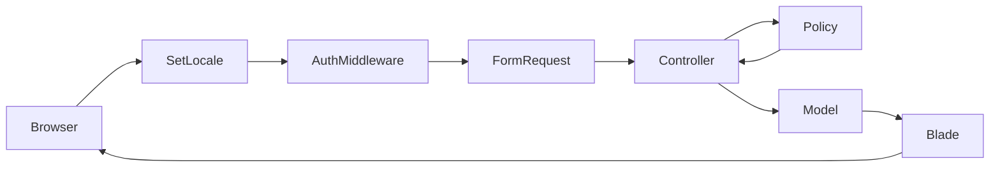

# CRM System Architecture

## 1. System Overview

This application is a web-based Customer Relationship Management (CRM) system for managing clients, deals, and sales pipelines. It targets three organizational roles — **administrator**, **head (supervisor)**, and **manager** — with role-scoped data access enforced at the policy and query-scope level.

### Business Goals

- Centralize client and deal lifecycle management with soft-delete archival.
- Restrict managers to their assigned clients and associated deals.
- Provide personal productivity tools (tasks, notes, calendar, reminders) per user.
- Offer a role-aware dashboard with sales funnel visualization and KPI panels.
- Support document and image attachments on clients and deals via drag-and-drop upload.
- Maintain configurable reference data (client/deal statuses) and system settings for administrators.

### Implementation Scope

The system is implemented as a **monolithic Laravel web application**. There is no public registration endpoint; users are created by administrators or heads. All UI is server-rendered via **Blade** with **Alpine.js** for client-side interactivity. No REST API layer, Inertia, Livewire, or Filament is used.

Internationalization supports **English (default)**, **Ukrainian**, and **Russian** via session-based locale switching and `__('messages.*')` translation keys.

---

## 2. Technology Stack

| Layer | Technology |
|---|---|
| Runtime | PHP 8.2 |
| Framework | Laravel 12 |
| Authentication | Session-based (email + password) |
| Authorization | Spatie Laravel Permission (roles) + Laravel Policies + Gates |
| ORM | Eloquent |
| Frontend | Blade, Alpine.js, Tailwind CSS, Vite |
| File Storage | Laravel Storage (`public` disk, `storage/app/public`) |
| Log Viewer | opcodesio/log-viewer (`/log-viewer`, admin gate) |
| Local Dev | Laravel Sail (Docker) |

---

## 3. Data Flow

### 3.1 Request Lifecycle

The actual request flow in this codebase:

```
HTTP Request
  → SetLocale Middleware
  → auth Middleware (authenticated routes)
  → role:admin Middleware (settings routes)
  → FormRequest (validation, when applicable)
  → Controller (routing, authorization, orchestration)
  → Policy (authorize via $this->authorize())
  → Eloquent Model (persistence, scopes, relations)
  → Blade View (HTML response)
```



**Note:** There is currently no Service, Action, Repository, or API Resource layer. Business logic lives in controllers (orchestration), Eloquent models (scopes, relations, helpers), and policies (access rules). This is intentional per project architecture rules.

### 3.2 Layer Decision Matrix

| Layer | Use When (SOLID/DRY) | Do Not Use When (KISS/YAGNI) |
|---|---|---|
| **FormRequest** | Validation rules exceed ~5 fields; complex or reusable validation. | Simple forms (2–3 fields), trivial search/delete. |
| **Service (`final`)** | Business logic exceeds ~12 lines; transactions; external API integration. | Simple CRUD (`Model::create()`, `Model::update()`). |
| **Action (`final`)** | Single-responsibility action when a Service would violate SRP. | Logic fits in 1–2 simple controller methods. |
| **DTO (spatie/laravel-data)** | Complex nested data structures from APIs. | Flat arrays with PHP typed parameters. |
| **Local Scope** | Repeated business query criteria (status, manager, date). | One-off system queries. |
| **Repository** | **Forbidden.** Replaced by Eloquent + local scopes. | Always. |

**Evolution rule:** Start with the simplest approach (KISS). Add Service/Action layers only when duplication or complexity demands it. All future Service/Action classes must be declared `final` with strict typing.

### 3.3 Design Principles in Practice

| Principle | Application |
|---|---|
| **KISS / YAGNI** | No Service/Repository abstractions for straightforward CRUD. Controllers call Eloquent directly. |
| **DRY** | Shared query logic in local scopes (`Client::mine()`, `Deal::forManager()`, `withStatus()`). Auto `updated_by` via `HasTrackedChanges` trait. |
| **SOLID** | Policies isolate authorization (SRP). FormRequests isolate validation. Controllers grouped by domain namespace. |
| **Strict Typing** | All PHP files use `declare(strict_types=1);`. Return types on controller methods. |

---

## 4. Core Modules

### 4.1 Authentication (`Auth\LoginController`)

- Session login via email/password.
- No self-registration; initial admin seeded via `AdminSeeder`.
- Logout destroys session.

### 4.2 Dashboard (`Dashboard\DashboardController`)

Invokable controller. Computes role-scoped KPIs:

- **Deals:** total, closed (`completed`), in progress (`in_progress`), active (`active`).
- **Clients:** potential, active, loyal (active clients with more than one deal).
- **Tasks:** pending tasks due today for the authenticated user.
- **Funnel:** deal counts by status for chart rendering.

Managers see only data linked to their assigned clients.

### 4.3 Clients (`Client\ClientController`)

Full resource CRUD with:

- Soft delete and restore (`POST clients/{id}/restore`).
- Archive toggle on index (shows trashed records, read-only).
- Avatar upload to `storage/app/public/clients`.
- Polymorphic file attachments.
- Authorization via `ClientPolicy`.
- Manager scoping via `Client::mine()` scope.

### 4.4 Deals (`Deal\DealController`)

Full resource CRUD linked to a client:

- Soft delete and restore.
- Amount stored as `decimal(12,2)`.
- Access inherited from parent client manager via `DealPolicy`.
- Polymorphic file attachments.

### 4.5 Managers (`Manager\ManagerController`)

Head/admin only (manual authorization check):

- List managers with client counts.
- Manager detail page with assigned clients and reassignment control.
- Toggle manager active/inactive status.
- Assign client to a different manager.

### 4.6 Files (`File\FileController`)

Polymorphic file management for `Client` and `Deal`:

- Upload via XHR (drag-and-drop component `<x-file-uploader>`).
- Allowed MIME types: images, PDF, Office documents, plain text, ZIP.
- Max size: 10 MB.
- Inline view (images/PDF), download, delete (removes from Storage).

### 4.7 Personal Tools (`Tools\*`)

Per-user, isolated data (no cross-user access):

| Tool | Controller | Behavior |
|---|---|---|
| Tasks | `TaskController` | CRUD, toggle completion, due date |
| Note | `NoteController` | Single note per user, patch update |
| Calendar | `CalendarController` | Events with start/end, all-day flag |
| Reminders | `ReminderController` | Scheduled reminders, dismiss, pending API |

### 4.8 Settings (`Settings\*`)

Admin-only (`role:admin` middleware on `/settings/*`):

- **SystemSettingsController:** app name and default locale persisted to `.env`.
- **ClientStatusController / DealStatusController:** CRUD with soft delete and restore for reference statuses.
- **Log viewer:** external package at `/log-viewer`, gated by `viewLogViewer`.

Head and manager users have read-only access to status directories in the UI; CRUD is restricted to admin.

### 4.9 Users & Profile

- **ProfileController:** authenticated user can update name, avatar, password (email is immutable).
- **UserController:** admin and head can create/edit users and assign roles.

---

## 5. Authorization Model

### 5.1 Roles

Defined in `App\Enums\UserRole`:

| Role | Slug | Capabilities |
|---|---|---|
| Administrator | `admin` | Full access; system settings; log viewer; status CRUD |
| Head | `head` | All business data; manager management; user CRUD (managers/heads) |
| Manager | `manager` | Own clients and their deals only; personal tools |

Roles are stored via Spatie Permission (`HasRoles` trait on `User`).

### 5.2 Policies

**ClientPolicy** — `canAccess()` grants full access to admin/head; managers access only clients where `manager_id === user.id`. Managers cannot create clients.

**DealPolicy** — `canAccess()` grants full access to admin/head; managers access deals whose parent client's `manager_id` matches.

### 5.3 Route Protection

```php
// routes/web.php (excerpt)
Route::middleware('auth')->group(function () {
    Route::prefix('settings')->middleware('role:admin')->group(function () {
        // admin-only settings
    });
});
```

### 5.4 Gates

```php
Gate::define('viewLogViewer', fn (?User $user): bool => $user?->isAdmin() ?? false);
```

---

## 6. Cross-Cutting Concerns

### 6.1 Soft Deletes & Audit Trail

Business entities (`clients`, `deals`, `client_statuses`, `deal_statuses`) use `SoftDeletes`. The `HasTrackedChanges` trait auto-sets `updated_by` on every update when a user is authenticated.

### 6.2 Internationalization

- `SetLocale` middleware reads session locale.
- Route `GET /locale/{locale}` switches between `en`, `ua`, `ru`.
- Translation files: `lang/{locale}/messages.php`, `lang/{locale}/auth.php`.

### 6.3 File Storage

Files stored under `storage/app/public/uploads/{type}/{id}/`. Public access via `storage` symlink. Client avatars stored in `clients/` directory.

---

## 7. Code Examples

### 7.1 Controller: Authorization + Scoped Query

```php
public function index(Request $request): View
{
    $this->authorize('viewAny', Client::class);

    $showArchived = $request->boolean('archived');

    $query = Client::with(['status', 'manager', 'updatedBy'])
        ->mine()
        ->when($showArchived, fn ($q) => $q->withTrashed())
        ->when(! $showArchived, fn ($q) => $q->withoutTrashed())
        ->when($request->filled('status'), fn ($q) => $q->where('client_status_id', $request->status))
        ->when($request->filled('manager'), fn ($q) => $q->where('manager_id', $request->manager))
        ->latest();

    $clients = $query->paginate(50)->withQueryString();

    return view('clients.index', compact('clients', /* ... */));
}
```

### 7.2 Policy: Role-Based Access

```php
private function canAccess(User $user, Client $client): bool
{
    if ($user->isAdmin() || $user->isHead()) {
        return true;
    }

    return $client->manager_id === $user->id;
}
```

### 7.3 Trait: Automatic Audit Field

```php
trait HasTrackedChanges
{
    public static function bootHasTrackedChanges(): void
    {
        static::updating(function (self $model): void {
            if (auth()->check()) {
                $model->updated_by = auth()->id();
            }
        });
    }
}
```

### 7.4 Model Scope: Manager Data Isolation

```php
public function scopeMine(Builder $query): Builder
{
    if (auth()->user()?->hasRole(UserRole::Manager->value)) {
        return $query->where('manager_id', auth()->id());
    }

    return $query;
}
```

---

## 8. Directory Structure (Key Paths)

```
app/
├── Enums/UserRole.php
├── Http/
│   ├── Controllers/{Auth,Client,Deal,Dashboard,File,Manager,Settings,Tools,User}/
│   ├── Middleware/SetLocale.php
│   ├── Requests/{Client,Deal,User,Settings}/
│   └── ...
├── Models/          # 10 Eloquent models
├── Policies/        # ClientPolicy, DealPolicy
├── Providers/       # AppServiceProvider (policy + gate registration)
└── Traits/          # HasTrackedChanges

database/migrations/ # Domain + Spatie permission + Laravel defaults
resources/views/     # Blade templates + components
routes/web.php       # All web routes
lang/{en,ua,ru}/     # Translation files
```

---

## 9. Related Documentation

- [DB_SCHEMA.md](DB_SCHEMA.md) — Entity-Relationship diagram of the database.
- [CLASS_DIAGRAM.md](CLASS_DIAGRAM.md) — UML class diagram of controllers, policies, models.

