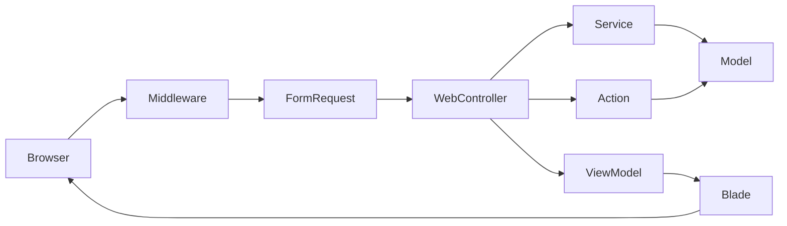

# CRM System Architecture

## 1. System Overview

This application is a web-based Customer Relationship Management (CRM) system for managing clients, deals, and sales pipelines. It targets three organizational roles — **administrator**, **head (supervisor)**, and **manager** — with role-scoped data access enforced at the policy and query-scope level.

### Business Goals

- Centralize client and deal lifecycle management with soft-delete archival.
- Restrict managers to their assigned clients and associated deals.
- Provide personal productivity tools (tasks, notes, calendar, reminders) per user.
- Offer a role-aware dashboard with sales funnel visualization and KPI panels.
- Support document and image attachments on clients and deals via drag-and-drop upload.
- Maintain configurable reference data (client/deal statuses) and system settings for administrators.

### Implementation Scope

The system is implemented as a **monolithic Laravel web application** following the **MRSRB** pattern (Model–Request–Service–Resource–Blade). There is no public registration endpoint; users are created by administrators or heads. The UI is server-rendered via **Blade** with **Alpine.js** for client-side interactivity. Inertia.js and Livewire are not used.

Internationalization supports **English (default)**, **Ukrainian**, and **Russian** via session-based locale switching and `__('messages.*')` translation keys.

---

## 2. Technology Stack

| Layer | Technology |
|---|---|
| Runtime | PHP 8.2 |
| Framework | Laravel 12 |
| Architecture | MRSRB (Model–Request–Service–Resource–Blade) |
| Authentication | Session-based (email + password) |
| Authorization | Spatie Laravel Permission (roles) + Laravel Policies + Gates |
| ORM | Eloquent |
| Caching | Redis (`ReferenceDataCache`, entity show, dashboard metrics) |
| Frontend | Blade, Alpine.js, Tailwind CSS, Vite |
| File Storage | Laravel Storage (`public` disk, `storage/app/public`) |
| Log Viewer | opcodesio/log-viewer (`/log-viewer`, admin gate) |
| Local Dev | Laravel Sail (Docker) |

---

## 3. MRSRB Architecture

**MRSRB** (Model–Request–Service–Resource–Blade) is the mandatory architectural pattern for this project. It enforces strict separation of concerns: controllers dispatch traffic, requests validate input, services and actions hold business logic, models define persistence, view models prepare Blade data, and (for future API endpoints) JsonResources format JSON responses.

### 3.1 Communication Flows

#### Web Flow (current — Blade)

```
HTTP Request
  → SetLocale / SyncSessionRoles Middleware
  → auth / role Middleware
  → FormRequest (validation + authorization)
  → Web Controller (thin dispatcher, ≤10 lines per method)
  → Service / Action (business logic, transactions, cache)
  → Model (Eloquent persistence, scopes, relations)
  → ViewModel (data preparation for Blade)
  → Blade View (HTML response)
```


```mermaid
flowchart LR
    Browser --> Middleware
    Middleware --> FormRequest
    FormRequest --> WebController
    WebController --> Service
    WebController --> Action
    Service --> Model
    Action --> Model
    WebController --> ViewModel
    ViewModel --> Blade
    Blade --> Browser
```

#### API Flow (planned — Vue 3, no Inertia)

```
Vue 3 SFC ──(Axios/Fetch JSON)──> Api Controller
  → FormRequest
  → Service / Action
  → Model
  → JsonResource (API response)
```

The **Resource** layer (`app/Http/Resources/`) is reserved for future Vue 3 REST endpoints. No Inertia.js — frontend communicates with Laravel exclusively over JSON APIs.

### 3.2 Layer Responsibilities

| Layer | Location | Responsibility | Rules |
|---|---|---|---|
| **Model** | `app/Models/` | Schema, casts, Eloquent relations, local scopes | No business calculations; no HTTP concerns |
| **Request** | `app/Http/Requests/{Domain}/` | Validation rules, `authorize()` via Policies | Required for every input-receiving controller method |
| **Service** | `app/Services/{Domain}/` | Multi-step logic, queries, caching, transactions | `final` class; domain-cohesive (e.g. `ClientService`) |
| **Action** | `app/Actions/{Domain}/` | Single atomic business event (create, restore, toggle) | `final` class; one public `execute()` method |
| **ViewModel** | `app/ViewModels/{Domain}/` | Data arrays for Blade views | No Eloquent queries; receives pre-loaded data from Service |
| **Resource** | `app/Http/Resources/` | JsonResource transformers for API | Not yet used; required for future API endpoints |
| **Web Controller** | `app/Http/Controllers/Web/{Domain}/` | Route dispatch, DI wiring, redirect/response | Thin: delegate all logic to Service/Action/ViewModel |
| **Api Controller** | `app/Http/Controllers/Api/` | JSON API dispatch | Not yet implemented |
| **Policy** | `app/Policies/` | Authorization rules per model | Invoked from FormRequest `authorize()` or `$this->authorize()` |

**Repository pattern is forbidden.** Data access goes through Eloquent models with local scopes.

### 3.3 Service vs Action

| Use **Service** when | Use **Action** when |
|---|---|
| Read operations (index, show, paginate) | Single write event with side effects |
| Reusable query logic across methods | Create / restore / toggle with cache invalidation |
| Cache read/write orchestration | Transactional operation that must not be split |
| Update/delete with shared domain rules | Logic used from exactly one controller method |

Example split in the Client domain:

- `ClientService` — `paginateFiltered()`, `loadForShow()`, `getFormOptions()`, `delete()`
- `CreateClientAction` — sets `created_by`, auto-assigns `manager_id` for managers, handles avatar upload
- `UpdateClientAction` — update with avatar replacement and cache invalidation
- `RestoreClientAction` — restore soft-deleted client

### 3.4 Bypass Rules (Simple / Flat Modules)

The full MRSRB stack must not be applied to trivial lookup tables or modules without complex business logic. A module qualifies for bypass when **all** of the following are true:

- No foreign keys or nested integrity constraints
- Read-only list or basic CRUD without state transitions
- No jobs, events, or third-party API calls on save

For bypass modules:

- Inline `$request->validate()` instead of FormRequest
- Direct Eloquent in controller instead of Service/Action
- `compact()` or plain arrays instead of ViewModel

**Current bypass modules:**

| Module | Controller | Reason |
|---|---|---|
| Auth | `Auth\LoginController` | Simple credential check |
| Profile | `ProfileController` | Self-service update, no domain rules |
| Users | `User\UserController` | Admin CRUD with inline role guard |
| Files | `File\FileController` | Upload/download; pending MRSRB refactor |

All other domain modules (Client, Deal, Dashboard, Manager, Tools, Settings) follow the full MRSRB flow.

---

## 4. Data Flow Details

### 4.1 Request Lifecycle

```
HTTP Request
  → SetLocale Middleware
  → SyncSessionRoles Middleware (auth routes)
  → auth Middleware
  → role:admin / role:admin|head Middleware (settings)
  → FormRequest (validation + authorization)
  → Web Controller
  → Policy (via authorize() in Request or Controller)
  → Service / Action
  → Model (Eloquent)
  → ViewModel → Blade
```

Authorization is enforced at two levels:

1. **FormRequest `authorize()`** — gate access before validation runs.
2. **Policy `$this->authorize()`** — additional checks in controller for route-model-bound resources.

Manager data isolation is enforced via Eloquent local scopes (`Client::mine()`, `Deal::forManager()`) inside Services, not in controllers or views.

### 4.2 Caching Layer

Services integrate Redis caching through dedicated infrastructure classes:

```
Service / Action
  ↓ read
ReferenceDataCache / Cache::remember
  ↓
Redis
  ↑ invalidate
CacheInvalidator (on write)
```

| Cached data | TTL | Invalidated by |
|---|---|---|
| Reference statuses, active managers | Forever (event-driven) | `CacheInvalidator` on status/user changes |
| Client/Deal show pages | 1 hour | `CacheInvalidator::forgetClient/forgetDeal` |
| Dashboard metrics per user | 1 hour | User-scoped invalidation on data changes |

See [docs/cache-system.md](docs/cache-system.md) for full key catalog and invalidation map.

---

## 5. Core Modules

All modules below use the MRSRB web flow unless marked as bypass.

### 5.1 Authentication (`Auth\LoginController`) — Bypass

- Session login via email/password with inline validation.
- Role snapshot written to session via `CacheInvalidator::applyUserRolesToSession()` on login.
- `SyncSessionRoles` middleware keeps session roles in sync with DB on subsequent requests.

### 5.2 Dashboard (`Web\Dashboard\DashboardController`)

| Layer | Class |
|---|---|
| Controller | `DashboardController` (invokable) |
| Service | `DashboardService` — role-scoped KPI aggregation with cache |
| ViewModel | `DashboardIndexViewModel` |

Computes: deal totals by status, client counts (potential, active, loyal), today's pending tasks, funnel chart data.

### 5.3 Clients (`Web\Client\ClientController`)

| Layer | Class |
|---|---|
| Controller | `ClientController` |
| Requests | `IndexClientRequest`, `StoreClientRequest`, `UpdateClientRequest`, `RestoreClientRequest` |
| Service | `ClientService` |
| Actions | `CreateClientAction`, `UpdateClientAction`, `RestoreClientAction` |
| ViewModels | `ClientIndexViewModel`, `ClientShowViewModel`, `ClientFormViewModel` |
| Policy | `ClientPolicy` |

Features: soft delete/restore, archive toggle, avatar upload, polymorphic file attachments, manager scoping via `Client::mine()`.

### 5.4 Deals (`Web\Deal\DealController`)

| Layer | Class |
|---|---|
| Controller | `DealController` |
| Requests | `IndexDealRequest`, `CreateDealRequest`, `StoreDealRequest`, `UpdateDealRequest` |
| Service | `DealService` |
| Actions | `CreateDealAction`, `RestoreDealAction` |
| ViewModels | `DealIndexViewModel`, `DealShowViewModel`, `DealFormViewModel` |
| Policy | `DealPolicy` |

Access inherited from parent client manager. Amount stored as `decimal(12,2)`.

### 5.5 Managers (`Web\Manager\ManagerController`)

| Layer | Class |
|---|---|
| Controller | `ManagerController` |
| Requests | `IndexManagerRequest`, `ShowManagerRequest`, `ToggleManagerRequest`, `AssignClientRequest` |
| Service | `ManagerService` |
| ViewModels | `ManagerIndexViewModel`, `ManagerShowViewModel` |

Head/admin only. List managers, detail with assigned clients, toggle active status, reassign clients.

### 5.6 Files (`File\FileController`) — Bypass (pending refactor)

Polymorphic file management for `Client` and `Deal`:

- Upload via XHR (drag-and-drop `<x-file-uploader>`).
- Allowed MIME types: images, PDF, Office documents, plain text, ZIP. Max 10 MB.
- Inline validation and direct Eloquent/Storage calls.

### 5.7 Personal Tools (`Web\Tools\*`)

Per-user isolated data. Each tool follows MRSRB:

| Tool | Controller | Service | Actions | ViewModel |
|---|---|---|---|---|
| Tasks | `TaskController` | `TaskService` | `CreateTaskAction`, `ToggleTaskAction` | `TaskIndexViewModel` |
| Note | `NoteController` | `NoteService` | — | `NoteIndexViewModel` |
| Calendar | `CalendarController` | `CalendarEventService` | `CreateCalendarEventAction` | `CalendarIndexViewModel` |
| Reminders | `ReminderController` | `ReminderService` | `CreateReminderAction`, `DismissReminderAction` | `ReminderIndexViewModel` |

`ReminderController::pending()` returns JSON via `ReminderService::pendingForUser()` — lightweight JSON endpoint without a dedicated Resource (internal Alpine.js polling).

### 5.8 Settings (`Web\Settings\*`)

| Controller | Service | ViewModel |
|---|---|---|
| `SystemSettingsController` | `SystemSettingsService` | `SystemSettingsIndexViewModel` |
| `ClientStatusController` | `ClientStatusService` | `ClientStatusIndexViewModel` |
| `DealStatusController` | `DealStatusService` | `DealStatusIndexViewModel` |

- **System settings** (`role:admin`): app name and default locale persisted to `.env`.
- **Status directories** (`role:admin|head`): CRUD with soft delete and restore.
- **Log viewer:** `/log-viewer`, gated by `viewLogViewer` (admin only).

### 5.9 Users & Profile

- **ProfileController** (bypass): authenticated user updates name, avatar, password.
- **UserController** (partial bypass): admin/head CRUD with `StoreUserRequest` / `UpdateUserRequest`; role guard inline in controller.

---

## 6. Authorization Model

### 6.1 Roles

Defined in `App\Enums\UserRole`:

| Role | Slug | Capabilities |
|---|---|---|
| Administrator | `admin` | Full access; system settings; log viewer; status CRUD; user CRUD (all roles) |
| Head | `head` | All business data; manager management; user CRUD (managers/heads); status CRUD |
| Manager | `manager` | Own clients and deals; can create clients (auto-assigned as manager); personal tools |

Roles stored via Spatie Permission (`HasRoles` trait on `User`). Session role snapshot managed by `CacheInvalidator` + `SyncSessionRoles`.

### 6.2 Policies

**ClientPolicy** — admin/head: full access; manager: only `manager_id === user.id`.

**DealPolicy** — admin/head: full access; manager: via parent client's `manager_id`.

### 6.3 Route Protection

```php
// routes/web.php (excerpt)
Route::prefix('settings')->group(function () {
    Route::middleware('role:admin')->group(function () {
        // system settings
    });
    Route::middleware('role:admin|head')->group(function () {
        // client-statuses, deal-statuses CRUD
    });
});
```

### 6.4 Gates

```php
Gate::define('viewLogViewer', fn (?User $user): bool => $user?->isAdmin() ?? false);
```

---

## 7. Cross-Cutting Concerns

### 7.1 Soft Deletes & Audit Trail

Business entities (`clients`, `deals`, `client_statuses`, `deal_statuses`) use `SoftDeletes`. The `HasTrackedChanges` trait auto-sets `updated_by` on every update when a user is authenticated.

### 7.2 Internationalization

- `SetLocale` middleware reads session locale.
- Route `GET /locale/{locale}` switches between `en`, `ua`, `ru`.
- Translation files: `lang/{locale}/messages.php`, `lang/{locale}/auth.php`.

### 7.3 File Storage

Files stored under `storage/app/public/uploads/{type}/{id}/`. Public access via `storage` symlink. Client avatars stored in `clients/` directory.

---

## 8. Code Examples

### 8.1 Thin Controller (MRSRB dispatch)

```php
public function index(IndexClientRequest $request, ClientService $service): View
{
    return view('clients.index', ClientIndexViewModel::from($service, $request)->toArray());
}

public function store(StoreClientRequest $request, CreateClientAction $action): RedirectResponse
{
    $action->execute($request);

    return redirect()->route('clients.index')
        ->with('success', __('messages.client_created'));
}
```

### 8.2 Service (queries + cache)

```php
final class ClientService
{
    public function paginateFiltered(IndexClientRequest $request): LengthAwarePaginator
    {
        return Client::with(['status', 'manager', 'updatedBy'])
            ->mine()
            ->when($request->boolean('archived'), fn ($q) => $q->withTrashed())
            ->when(! $request->boolean('archived'), fn ($q) => $q->withoutTrashed())
            ->when($request->filled('status'), fn ($q) => $q->where('client_status_id', $request->input('status')))
            ->latest()
            ->paginate(50)
            ->withQueryString();
    }

    public function loadForShow(Client $client): Client
    {
        return Cache::remember(
            CacheKey::clientShow($client->id),
            CacheKey::ENTITY_TTL,
            fn () => $client->load(['status', 'manager', 'deals.status', 'updatedBy', 'createdBy', 'files'])
        );
    }
}
```

### 8.3 Action (atomic write)

```php
final class CreateClientAction
{
    public function execute(StoreClientRequest $request): Client
    {
        $data = $request->validated();
        $data['created_by'] = auth()->id();

        if (auth()->user()->isManager()) {
            $data['manager_id'] = auth()->id();
        }

        if ($request->hasFile('avatar')) {
            $data['avatar'] = $request->file('avatar')->store('clients', 'public');
        }

        $client = Client::create($data);
        $this->cacheInvalidator->forgetClient($client);

        return $client;
    }
}
```

### 8.4 ViewModel (Blade data preparation)

```php
final class ClientIndexViewModel
{
    public static function from(ClientService $service, IndexClientRequest $request): self
    {
        $options = $service->getFormOptions();

        return new self([
            'clients' => $service->paginateFiltered($request),
            'statuses' => $options['statuses'],
            'managers' => $options['managers'],
            'showArchived' => $request->boolean('archived'),
        ]);
    }

    public function toArray(): array
    {
        return $this->data;
    }
}
```

### 8.5 FormRequest (validation + authorization)

```php
class StoreClientRequest extends FormRequest
{
    public function authorize(): bool
    {
        return $this->user()->can('create', Client::class);
    }

    public function rules(): array
    {
        return [
            'name' => ['required', 'string', 'max:255'],
            'email' => ['nullable', 'email', 'max:255'],
            'client_status_id' => ['nullable', 'exists:client_statuses,id'],
            'avatar' => ['nullable', 'image', 'max:2048'],
        ];
    }
}
```

---

## 9. Directory Structure

```
app/
├── Actions/{Client,Deal,Task,Reminder,CalendarEvent}/   # Atomic write operations
├── Enums/UserRole.php
├── Http/
│   ├── Controllers/
│   │   ├── Auth/                    # Bypass: login/logout
│   │   ├── File/                    # Bypass: file upload (pending refactor)
│   │   ├── Web/
│   │   │   ├── Client/
│   │   │   ├── Deal/
│   │   │   ├── Dashboard/
│   │   │   ├── Manager/
│   │   │   ├── Settings/
│   │   │   └── Tools/
│   │   ├── ProfileController.php    # Bypass
│   │   └── User/                    # Partial bypass
│   ├── Middleware/SetLocale.php, SyncSessionRoles.php
│   ├── Requests/{Client,Deal,Task,Reminder,CalendarEvent,Note,Manager,Settings,User}/
│   └── Resources/                   # Reserved for future Vue 3 API
├── Models/                          # 10 Eloquent models
├── Policies/                        # ClientPolicy, DealPolicy
├── Providers/AppServiceProvider.php
├── Services/
│   ├── Cache/                       # ReferenceDataCache, CacheInvalidator
│   ├── Client/, Deal/, Dashboard/, Manager/
│   ├── Settings/, Task/, Note/, Reminder/, CalendarEvent/
├── Support/Cache/CacheKey.php
├── Traits/HasTrackedChanges.php
└── ViewModels/{Client,Deal,Dashboard,Manager,Settings,Task,Note,Reminder,CalendarEvent}/

database/migrations/
resources/views/                     # Blade templates + components
routes/web.php
lang/{en,ua,ru}/
docs/cache-system.md                 # Caching subsystem documentation
```

---

## 10. Related Documentation

- [DB_SCHEMA.md](DB_SCHEMA.md) — Entity-Relationship diagram of the database.
- [CLASS_DIAGRAM.md](CLASS_DIAGRAM.md) — UML class diagram: controllers, services, actions, view models, policies, models.
- [docs/cache-system.md](docs/cache-system.md) — Redis caching architecture and invalidation rules.
- [.cursor/SKILLS.md](.cursor/SKILLS.md) — MRSRB coding standards and AI generation rules.
