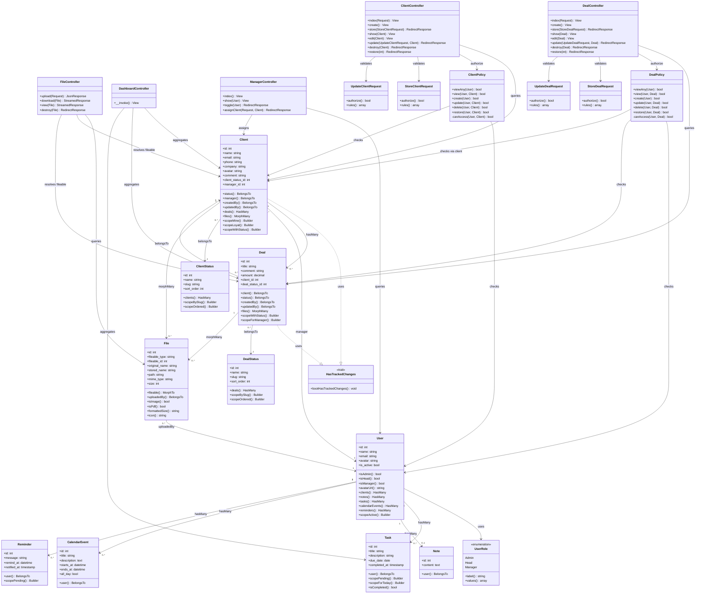

# UML Class Diagram

```mermaid
classDiagram
    direction TB

    class UserRole {
        <<enumeration>>
        Admin
        Head
        Manager
        +label() string
        +values() array
    }

    class HasTrackedChanges {
        <<trait>>
        +bootHasTrackedChanges() void
    }

    class User {
        +id: int
        +name: string
        +email: string
        +avatar: string
        +is_active: bool
        +isAdmin() bool
        +isHead() bool
        +isManager() bool
        +avatarUrl() string
        +clients() HasMany
        +notes() HasMany
        +tasks() HasMany
        +calendarEvents() HasMany
        +reminders() HasMany
        +scopeActive() Builder
    }

    class Client {
        +id: int
        +name: string
        +email: string
        +phone: string
        +company: string
        +avatar: string
        +comment: string
        +client_status_id: int
        +manager_id: int
        +status() BelongsTo
        +manager() BelongsTo
        +createdBy() BelongsTo
        +updatedBy() BelongsTo
        +deals() HasMany
        +files() MorphMany
        +scopeMine() Builder
        +scopeLoyal() Builder
        +scopeWithStatus() Builder
    }

    class Deal {
        +id: int
        +title: string
        +comment: string
        +amount: decimal
        +client_id: int
        +deal_status_id: int
        +client() BelongsTo
        +status() BelongsTo
        +createdBy() BelongsTo
        +updatedBy() BelongsTo
        +files() MorphMany
        +scopeWithStatus() Builder
        +scopeForManager() Builder
    }

    class ClientStatus {
        +id: int
        +name: string
        +slug: string
        +sort_order: int
        +clients() HasMany
        +scopeBySlug() Builder
        +scopeOrdered() Builder
    }

    class DealStatus {
        +id: int
        +name: string
        +slug: string
        +sort_order: int
        +deals() HasMany
        +scopeBySlug() Builder
        +scopeOrdered() Builder
    }

    class File {
        +id: int
        +fileable_type: string
        +fileable_id: int
        +original_name: string
        +stored_name: string
        +path: string
        +mime_type: string
        +size: int
        +fileable() MorphTo
        +uploadedBy() BelongsTo
        +isImage() bool
        +isPdf() bool
        +formattedSize() string
        +icon() string
    }

    class Task {
        +id: int
        +title: string
        +description: string
        +due_date: date
        +completed_at: timestamp
        +user() BelongsTo
        +scopePending() Builder
        +scopeForToday() Builder
        +isCompleted() bool
    }

    class Note {
        +id: int
        +content: text
        +user() BelongsTo
    }

    class CalendarEvent {
        +id: int
        +title: string
        +description: text
        +starts_at: datetime
        +ends_at: datetime
        +all_day: bool
        +user() BelongsTo
    }

    class Reminder {
        +id: int
        +message: string
        +remind_at: datetime
        +notified_at: timestamp
        +user() BelongsTo
        +scopePending() Builder
    }

    class ClientController {
        +index(Request) View
        +create() View
        +store(StoreClientRequest) RedirectResponse
        +show(Client) View
        +edit(Client) View
        +update(UpdateClientRequest, Client) RedirectResponse
        +destroy(Client) RedirectResponse
        +restore(int) RedirectResponse
    }

    class DealController {
        +index(Request) View
        +create() View
        +store(StoreDealRequest) RedirectResponse
        +show(Deal) View
        +edit(Deal) View
        +update(UpdateDealRequest, Deal) RedirectResponse
        +destroy(Deal) RedirectResponse
        +restore(int) RedirectResponse
    }

    class FileController {
        +upload(Request) JsonResponse
        +download(File) StreamedResponse
        +view(File) StreamedResponse
        +destroy(File) RedirectResponse
    }

    class DashboardController {
        +__invoke() View
    }

    class ManagerController {
        +index() View
        +show(User) View
        +toggle(User) RedirectResponse
        +assignClient(Request, Client) RedirectResponse
    }

    class ClientPolicy {
        +viewAny(User) bool
        +view(User, Client) bool
        +create(User) bool
        +update(User, Client) bool
        +delete(User, Client) bool
        +restore(User, Client) bool
        -canAccess(User, Client) bool
    }

    class DealPolicy {
        +viewAny(User) bool
        +view(User, Deal) bool
        +create(User) bool
        +update(User, Deal) bool
        +delete(User, Deal) bool
        +restore(User, Deal) bool
        -canAccess(User, Deal) bool
    }

    class StoreClientRequest {
        +authorize() bool
        +rules() array
    }

    class UpdateClientRequest {
        +authorize() bool
        +rules() array
    }

    class StoreDealRequest {
        +authorize() bool
        +rules() array
    }

    class UpdateDealRequest {
        +authorize() bool
        +rules() array
    }

    User --> UserRole : uses
    Client ..|> HasTrackedChanges : uses
    Deal ..|> HasTrackedChanges : uses

    Client "1" --> "0..*" Deal : hasMany
    Client "0..*" --> "1" User : manager
    Client "0..*" --> "1" ClientStatus : belongsTo
    Deal "0..*" --> "1" Client : belongsTo
    Deal "0..*" --> "1" DealStatus : belongsTo
    Client "1" --> "0..*" File : morphMany
    Deal "1" --> "0..*" File : morphMany
    File "0..*" --> "1" User : uploadedBy
    User "1" --> "0..*" Task : hasMany
    User "1" --> "0..1" Note : hasMany
    User "1" --> "0..*" CalendarEvent : hasMany
    User "1" --> "0..*" Reminder : hasMany

    ClientController --> Client : queries
    ClientController --> ClientPolicy : authorize
    ClientController --> StoreClientRequest : validates
    ClientController --> UpdateClientRequest : validates

    DealController --> Deal : queries
    DealController --> DealPolicy : authorize
    DealController --> StoreDealRequest : validates
    DealController --> UpdateDealRequest : validates

    FileController --> File : queries
    FileController --> Client : resolves fileable
    FileController --> Deal : resolves fileable

    DashboardController --> Client : aggregates
    DashboardController --> Deal : aggregates
    DashboardController --> Task : aggregates

    ManagerController --> User : queries
    ManagerController --> Client : assigns

    ClientPolicy --> User : checks
    ClientPolicy --> Client : checks
    DealPolicy --> User : checks
    DealPolicy --> Deal : checks
    DealPolicy --> Client : checks via client
```
