# UML Class Diagram

MRSRB layer dependencies for the CRM domain. Controllers depend on Services, Actions, ViewModels, and FormRequests. Services and Actions depend on Models. ViewModels receive pre-loaded data from Services — they do not query the database directly.

```mermaid
classDiagram
    direction TB

    class UserRole {
        <<enumeration>>
        Admin
        Head
        Manager
        +label() string
        +values() array
    }

    class HasTrackedChanges {
        <<trait>>
        +bootHasTrackedChanges() void
    }

    %% ── Models ──

    class User {
        +id: int
        +name: string
        +email: string
        +avatar: string
        +is_active: bool
        +isAdmin() bool
        +isHead() bool
        +isManager() bool
        +clients() HasMany
        +tasks() HasMany
        +scopeActive() Builder
    }

    class Client {
        +id: int
        +name: string
        +client_status_id: int
        +manager_id: int
        +status() BelongsTo
        +manager() BelongsTo
        +deals() HasMany
        +files() MorphMany
        +scopeMine() Builder
        +scopeLoyal() Builder
        +scopeWithStatus() Builder
    }

    class Deal {
        +id: int
        +title: string
        +amount: decimal
        +client_id: int
        +deal_status_id: int
        +client() BelongsTo
        +status() BelongsTo
        +files() MorphMany
        +scopeWithStatus() Builder
        +scopeForManager() Builder
    }

    class ClientStatus {
        +id: int
        +name: string
        +slug: string
        +scopeOrdered() Builder
    }

    class DealStatus {
        +id: int
        +name: string
        +slug: string
        +scopeOrdered() Builder
    }

    class Task {
        +id: int
        +title: string
        +due_date: date
        +completed_at: timestamp
        +user() BelongsTo
        +scopePending() Builder
        +scopeForToday() Builder
    }

    class File {
        +id: int
        +fileable_type: string
        +fileable_id: int
        +fileable() MorphTo
        +isImage() bool
    }

    %% ── Requests ──

    class StoreClientRequest {
        +authorize() bool
        +rules() array
    }

    class IndexClientRequest {
        +authorize() bool
        +rules() array
    }

    class StoreDealRequest {
        +authorize() bool
        +rules() array
    }

    %% ── Services ──

    class ClientService {
        <<final>>
        +paginateFiltered(IndexClientRequest) LengthAwarePaginator
        +getFormOptions() array
        +loadForShow(Client) Client
        +delete(Client) void
    }

    class DealService {
        <<final>>
        +paginateFiltered(IndexDealRequest) LengthAwarePaginator
        +loadForShow(Deal) Deal
        +update(Deal, array) void
        +delete(Deal) void
    }

    class DashboardService {
        <<final>>
        +getMetrics(User) array
    }

    class TaskService {
        <<final>>
        +paginateForUser(User) Collection
        +delete(Task) void
    }

    class ReferenceDataCache {
        <<final>>
        +clientStatusesOrdered() Collection
        +activeManagers() Collection
        +dealStatusSlugMap() array
    }

    class CacheInvalidator {
        <<final>>
        +forgetClient(Client) void
        +forgetDeal(Deal) void
        +forgetManagers() void
    }

    %% ── Actions ──

    class CreateClientAction {
        <<final>>
        +execute(StoreClientRequest) Client
    }

    class UpdateClientAction {
        <<final>>
        +execute(UpdateClientRequest, Client) Client
    }

    class CreateDealAction {
        <<final>>
        +execute(array) Deal
    }

    class CreateTaskAction {
        <<final>>
        +execute(StoreTaskRequest) Task
    }

    %% ── ViewModels ──

    class ClientIndexViewModel {
        <<final>>
        +from(ClientService, IndexClientRequest)$ ClientIndexViewModel
        +toArray() array
    }

    class ClientShowViewModel {
        <<final>>
        +toArray() array
    }

    class DealIndexViewModel {
        <<final>>
        +from(DealService, IndexDealRequest)$ DealIndexViewModel
        +toArray() array
    }

    class DashboardIndexViewModel {
        <<final>>
        +from(DashboardService, User)$ DashboardIndexViewModel
        +toArray() array
    }

    class TaskIndexViewModel {
        <<final>>
        +from(TaskService, IndexTaskRequest)$ TaskIndexViewModel
        +toArray() array
    }

    %% ── Controllers ──

    class ClientController {
        +index(IndexClientRequest, ClientService) View
        +store(StoreClientRequest, CreateClientAction) RedirectResponse
        +show(Client, ClientService) View
        +update(UpdateClientRequest, Client, UpdateClientAction) RedirectResponse
        +destroy(Client, ClientService) RedirectResponse
    }

    class DealController {
        +index(IndexDealRequest, DealService) View
        +store(StoreDealRequest, CreateDealAction) RedirectResponse
        +show(Deal, DealService) View
        +update(UpdateDealRequest, Deal, DealService) RedirectResponse
    }

    class DashboardController {
        +__invoke(DashboardService) View
    }

    class TaskController {
        +index(IndexTaskRequest, TaskService) View
        +store(StoreTaskRequest, CreateTaskAction) RedirectResponse
    }

    class FileController {
        <<bypass>>
        +upload(Request) JsonResponse
        +destroy(File) JsonResponse
    }

    %% ── Policies ──

    class ClientPolicy {
        +viewAny(User) bool
        +view(User, Client) bool
        +create(User) bool
        -canAccess(User, Client) bool
    }

    class DealPolicy {
        +viewAny(User) bool
        +view(User, Deal) bool
        -canAccess(User, Deal) bool
    }

    %% ── Model relations ──

    User --> UserRole : uses
    Client ..|> HasTrackedChanges : uses
    Deal ..|> HasTrackedChanges : uses

    Client "1" --> "0..*" Deal : hasMany
    Client "0..*" --> "1" User : manager
    Client "0..*" --> "1" ClientStatus : belongsTo
    Deal "0..*" --> "1" Client : belongsTo
    Deal "0..*" --> "1" DealStatus : belongsTo
    Client "1" --> "0..*" File : morphMany
    Deal "1" --> "0..*" File : morphMany
    User "1" --> "0..*" Task : hasMany

    %% ── MRSRB dependencies ──

    ClientController --> StoreClientRequest : validates
    ClientController --> IndexClientRequest : validates
    ClientController --> ClientService : reads
    ClientController --> CreateClientAction : writes
    ClientController --> UpdateClientAction : writes
    ClientController --> ClientIndexViewModel : prepares view
    ClientController --> ClientShowViewModel : prepares view
    ClientController --> ClientPolicy : authorize

    DealController --> StoreDealRequest : validates
    DealController --> DealService : reads/writes
    DealController --> CreateDealAction : writes
    DealController --> DealIndexViewModel : prepares view
    DealController --> DealPolicy : authorize

    DashboardController --> DashboardService : reads
    DashboardController --> DashboardIndexViewModel : prepares view

    TaskController --> TaskService : reads
    TaskController --> CreateTaskAction : writes
    TaskController --> TaskIndexViewModel : prepares view

    ClientService --> Client : queries
    ClientService --> ReferenceDataCache : cache read
    ClientService --> CacheInvalidator : cache invalidate

    DealService --> Deal : queries
    DealService --> ReferenceDataCache : cache read
    DealService --> CacheInvalidator : cache invalidate

    DashboardService --> Client : aggregates
    DashboardService --> Deal : aggregates
    DashboardService --> Task : aggregates
    DashboardService --> ReferenceDataCache : cache read

    CreateClientAction --> Client : creates
    CreateClientAction --> CacheInvalidator : cache invalidate
    CreateDealAction --> Deal : creates
    CreateTaskAction --> Task : creates

    ClientIndexViewModel --> ClientService : from()
    DashboardIndexViewModel --> DashboardService : from()

    StoreClientRequest --> ClientPolicy : authorize
    StoreDealRequest --> DealPolicy : authorize

    ClientPolicy --> User : checks
    ClientPolicy --> Client : checks
    DealPolicy --> Client : checks via client
```



## Bypass Modules (not shown in detail)

These controllers intentionally skip Service/Action/ViewModel layers:

| Controller | Pattern |
|---|---|
| `Auth\LoginController` | Inline validation, direct Auth facade |
| `ProfileController` | Inline validation, direct User update |
| `User\UserController` | FormRequest + inline Eloquent |
| `File\FileController` | Inline validation, direct Eloquent/Storage |

## Planned API Layer

When Vue 3 REST endpoints are added, the flow extends MRSRB with:

```
ApiController → FormRequest → Service/Action → Model → JsonResource
```

`app/Http/Resources/` and `app/Http/Controllers/Api/` directories are reserved for this purpose.
