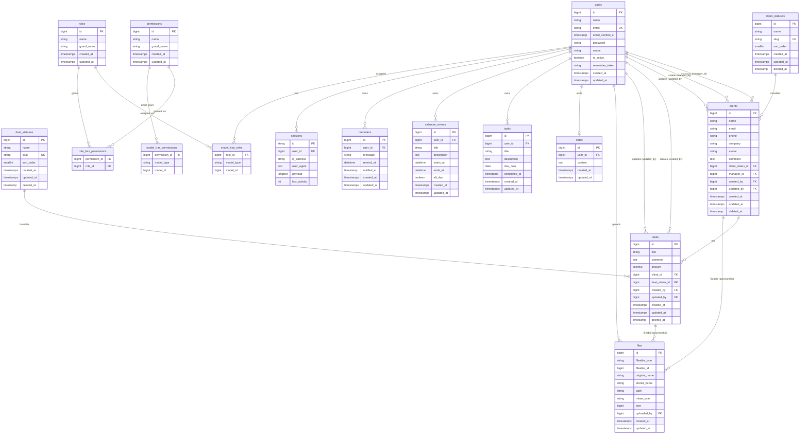

# Database Entity-Relationship Diagram

```mermaid
erDiagram
    users {
        bigint id PK
        string name
        string email UK
        timestamp email_verified_at
        string password
        string avatar
        boolean is_active
        string remember_token
        timestamps created_at
        timestamps updated_at
    }

    client_statuses {
        bigint id PK
        string name
        string slug UK
        smallint sort_order
        timestamps created_at
        timestamps updated_at
        timestamp deleted_at
    }

    deal_statuses {
        bigint id PK
        string name
        string slug UK
        smallint sort_order
        timestamps created_at
        timestamps updated_at
        timestamp deleted_at
    }

    clients {
        bigint id PK
        string name
        string email
        string phone
        string company
        string avatar
        text comment
        bigint client_status_id FK
        bigint manager_id FK
        bigint created_by FK
        bigint updated_by FK
        timestamps created_at
        timestamps updated_at
        timestamp deleted_at
    }

    deals {
        bigint id PK
        string title
        text comment
        decimal amount
        bigint client_id FK
        bigint deal_status_id FK
        bigint created_by FK
        bigint updated_by FK
        timestamps created_at
        timestamps updated_at
        timestamp deleted_at
    }

    files {
        bigint id PK
        string fileable_type
        bigint fileable_id
        string original_name
        string stored_name
        string path
        string mime_type
        bigint size
        bigint uploaded_by FK
        timestamps created_at
        timestamps updated_at
    }

    notes {
        bigint id PK
        bigint user_id FK
        text content
        timestamps created_at
        timestamps updated_at
    }

    tasks {
        bigint id PK
        bigint user_id FK
        string title
        text description
        date due_date
        timestamp completed_at
        timestamps created_at
        timestamps updated_at
    }

    calendar_events {
        bigint id PK
        bigint user_id FK
        string title
        text description
        datetime starts_at
        datetime ends_at
        boolean all_day
        timestamps created_at
        timestamps updated_at
    }

    reminders {
        bigint id PK
        bigint user_id FK
        string message
        datetime remind_at
        timestamp notified_at
        timestamps created_at
        timestamps updated_at
    }

    roles {
        bigint id PK
        string name
        string guard_name
        timestamps created_at
        timestamps updated_at
    }

    permissions {
        bigint id PK
        string name
        string guard_name
        timestamps created_at
        timestamps updated_at
    }

    model_has_roles {
        bigint role_id FK
        string model_type
        bigint model_id
    }

    model_has_permissions {
        bigint permission_id FK
        string model_type
        bigint model_id
    }

    role_has_permissions {
        bigint permission_id FK
        bigint role_id FK
    }

    sessions {
        string id PK
        bigint user_id FK
        string ip_address
        text user_agent
        longtext payload
        int last_activity
    }

    users ||--o{ clients : "manages (manager_id)"
    users ||--o{ clients : "creates (created_by)"
    users ||--o{ clients : "updates (updated_by)"
    users ||--o{ deals : "creates (created_by)"
    users ||--o{ deals : "updates (updated_by)"
    users ||--o{ files : "uploads"
    users ||--o| notes : "owns"
    users ||--o{ tasks : "owns"
    users ||--o{ calendar_events : "owns"
    users ||--o{ reminders : "owns"
    users ||--o{ sessions : "has"
    users ||--o{ model_has_roles : "assigned"

    client_statuses ||--o{ clients : "classifies"
    deal_statuses ||--o{ deals : "classifies"

    clients ||--o{ deals : "has"
    clients ||--o{ files : "fileable (polymorphic)"
    deals ||--o{ files : "fileable (polymorphic)"

    roles ||--o{ model_has_roles : "assigned via"
    roles ||--o{ role_has_permissions : "grants"
    permissions ||--o{ role_has_permissions : "granted via"
    permissions ||--o{ model_has_permissions : "direct grant"
```
